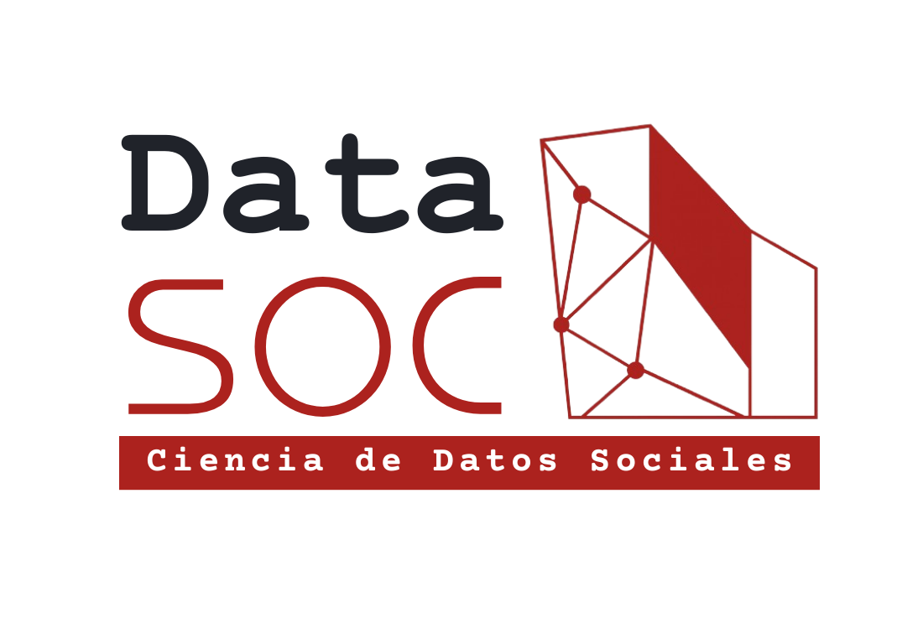

:::hero-heading

:::

<!-- ====================== DATASOC ====================== -->
::: {.parallax-container}
::: {.parallax-image-container2}

  

    dataSOC
  

  

dataSOC es el Centro de Datos Sociales de la Facultad de Ciencias Sociales de la Universidad de Chile. Su objetivo es posicionar a FACSO como un referente en el análisis, procesamiento, gestión y transferencia de datos sociales, en un marco de ciencia abierta, guiado por altos estándares conceptuales, metodológicos y éticos. 
  

:::
:::
