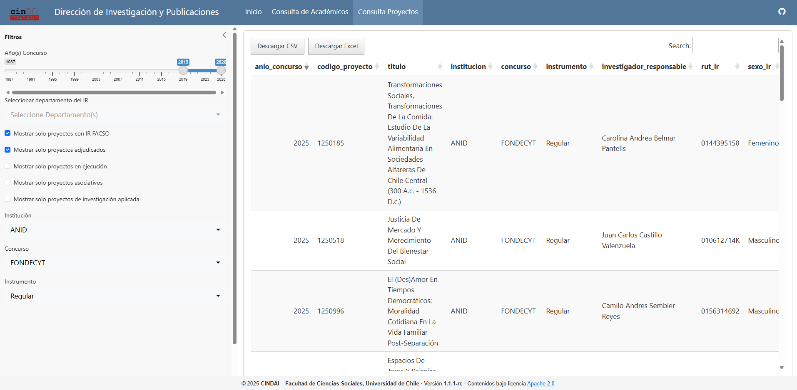
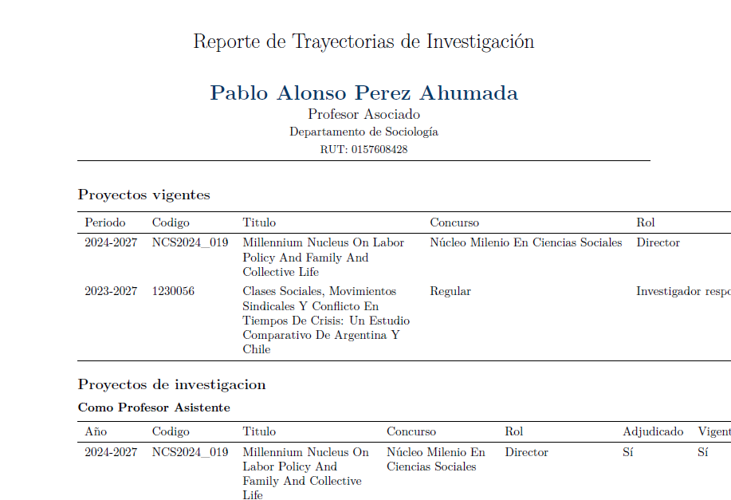
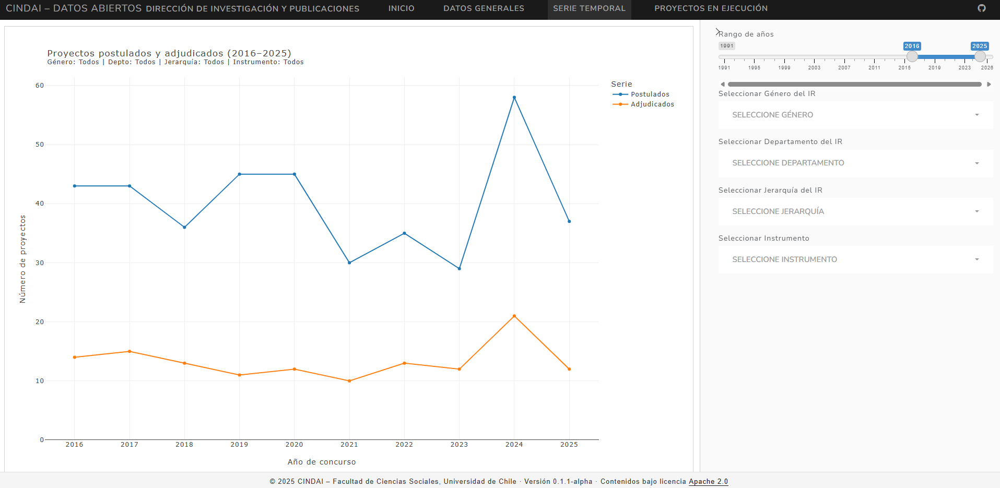

---
title: CINDAI
subtitle: Ciencias de Datos de Investigación
description: "CINDAI es el primer sistema de gestión de datos desarrollado por DataSOC. Su función consiste en facilitar el análisis de información científica en la Dirección de Investigación y Publicaciones de la Facultad de Ciencias Sociales"
categories: [Gobernanza de Datos]
image: "featured.png"
date: last-modified
lang: es
draft: false
about:
  template: marquee
  image: "featured.png"
  # image-alt: "Ilustración de ciencia abierta con iconos de datos y colaboración"
format:
   html:
    # theme: scss-posts.scss
    # css: [styles/pro.css]
    toc: false
    toc-depth: 2
    smooth-scroll: true
    link-external-newwindow: true
    link-external-icon: false
    df-print: paged
    code-copy: false
    page-layout: article
filters: []
team: "Gabriel Cortés"

listing:
  - id: equipo-proyecto
    contents:
      - "../../../equipo/posts/c- gc/_metadata.yml" 
    # -  agregar cuantos perfiles sea necesario
    template: "../../team-card.ejs"
--- 

Frente a la necesidad de contar con datos gobernados y actualizados sobre las actividades de investigación de la Facultad de Ciencias Sociales, que permitan trazar y analizar las trayectorias académicas y fortalecer la generación de reportes integrados sobre productividad científica, DataSOC y la Dirección de Investigación y Publicaciones (DIP) proponen la creación de la **Plataforma de Ciencia de Datos en Investigación -- CINDAI**. Con CINDAI, buscamos desarrollar un sistema local e integrado de gestión, producción y visualización de información científica en la Facultad de Ciencias Sociales. Este sistema consolida y mantiene actualizados los datos relacionados con las postulaciones a proyectos de investigación de los académicos/as de la Facultad, transformándolos en información confiable y oportuna para la comunicación y la toma decisiones.

La propuesta se basa en la aplicación de los principios FAIR (Findable, Accesible, Interoperable and Reusable). Estos principios buscan crear un ecosistema de gestión del conocimiento más abierto y eficiente, facilitando que los datos sean fácilmente localizable, accesibles, integrables y reutilizables tanto por personas como por sistemas (Hartley Belmar et al., 2025).

La implementación de estos principios en la gestión de información no solo mejora el acceso y uso eficiente de los datos, sino que también impulsa una cultura institucional de apertura, colaboración y transparencia en la investigación. Al incorporar los principios FAIR en la estructura y gobernanza de datos de la Facultad, CINDAI busca transformar la manera en que se gestionan, actualizan y reutilizan los datos, garantizando su accesibilidad, reproducibilidad y valor público para la comunidad académica.

La propuesta de CINDAI tiene como base consolidar datos dispersos en distintas bases de datos provenientes tanto de ANID, la Vicerrectoría de Investigación y la Facultad de Ciencias Sociales. A partir de estos origenes, se construyó una Base Integrada que contiene información relevante spara caracterizar los proyectos de investigación postulados y adjudicados, los académicos involucradas y sus trayectorias como investigadores. 

A partir de esta base fue posible construir una app de consulta que permite visualizar de manera rápida información sobre académicos y proyectos de investigación, así como generar reportes en diversos formatos. Esta plataforma permite aumentar la eficiencia en el trabajo de gestión del equipo de la DIP. Tanto la construcción de la base de datos y como de la app están debidamente documentadas a través de un Manual de Uso y un Libro de Códigos. 

::: {layout-ncol=2}
{.lightbox}

{.lightbox}
:::

Paralalamente, se está trabajando en una plataforma de visualización orientada hacia el público externo, facilitando la difusión del trabajo investigativo de FACSO a través de los años.

{.lightbox}

Además, nos encontramos trabajando en mejorar el Registro de Patrocinios de Investigación de la Dirección de Investigación, con el propósito de facilitar las postulaciones de los académicos y académicas de la Facultad y hacer más eficiente el flujo de producción de información sobre proyectos de investigación. 

## Responsable del Proyecto

::: {#equipo-proyecto}
:::